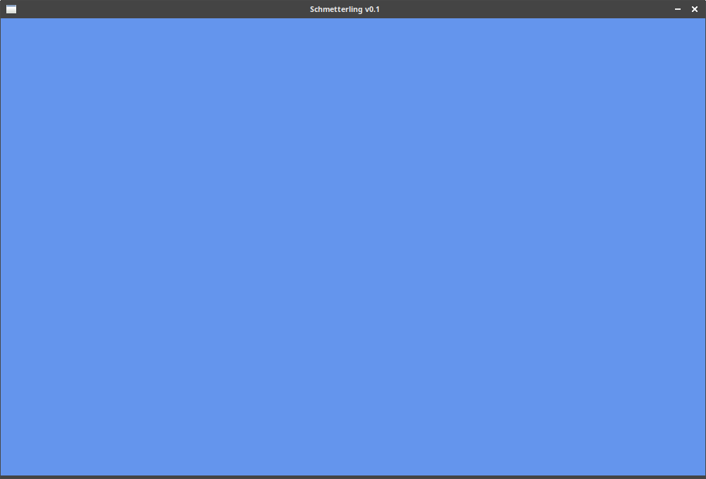

# Purpose of this file
This is to keep track of brainstorming and difficulties and successes during the 
work on this PyWeek challenge. It will also allow to do a post-mortem of my working 
habits and what should change

## Day 1: 2020-03-22
###### (mostly brainstorming)
The butterfly effect theme is something a little hard for me to picture, but I would 
like to make a game where you catch butterflies, and every time you catch one,
a colour disappears in the world. It sounds silly but this is my first idea. It would
be a more contemplative game, as there is no real way to win in 
my idea for now.

Or it could be the other way around, ***every time the player catches a butterfly, they
get a new thing, power, or colour, ending the game with a huge butterfly as a 
reward.*** I like this second idea better.

Maybe mixing ***some butterflies having a good effect and others a bad***.

###### Links found that might be useful
https://buildmedia.readthedocs.org/media/pdf/pyweek/latest/pyweek.pdf

## Day 2: 2020-03-23
###### mucking around with the arcade library
Small tests with it, nothing very pertinent besides a game window.
Thinking about designing one level for today.

Looked around for some music/sounds.

###### Links found that might be useful
* Music:
  * https://opengameart.org/content/soft-mysterious-harp-loop for the menu (or the first level if no menu)
  * https://opengameart.org/content/temple-of-the-mystics for another level (or the first if menu) (but lower volume)
* Sounds:
  * https://opengameart.org/content/shimmer-glitter-magic
  * https://opengameart.org/content/completion-sound
  * https://opengameart.org/content/level-up-power-up-coin-get-13-sounds
  * https://opengameart.org/content/bell-dingschimes

